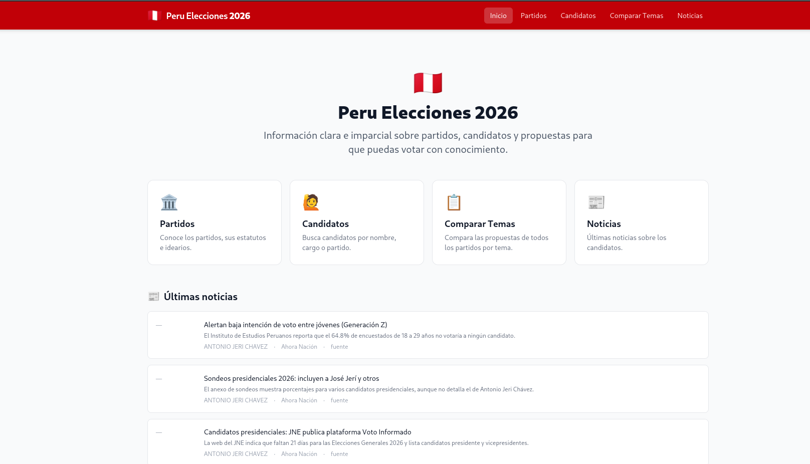
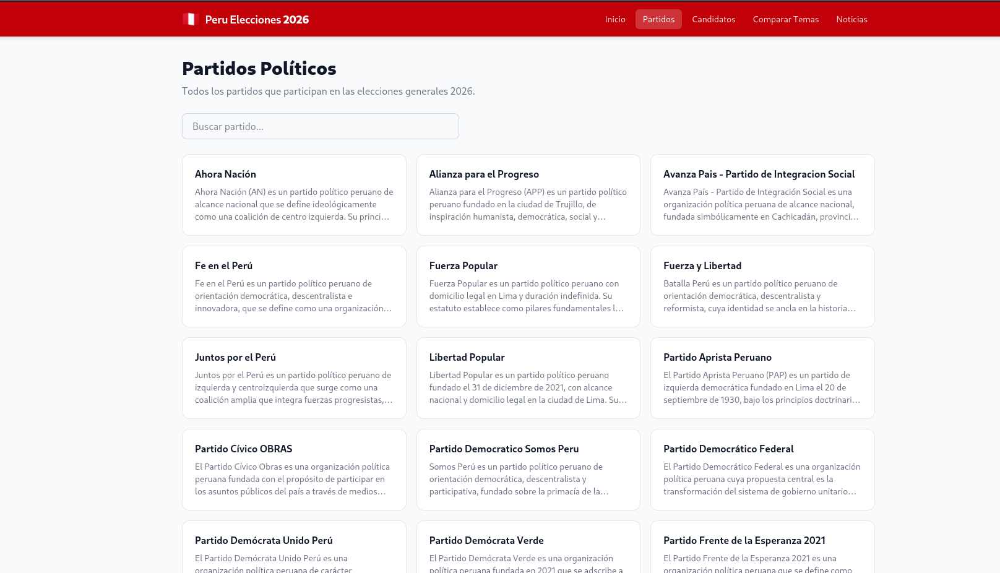
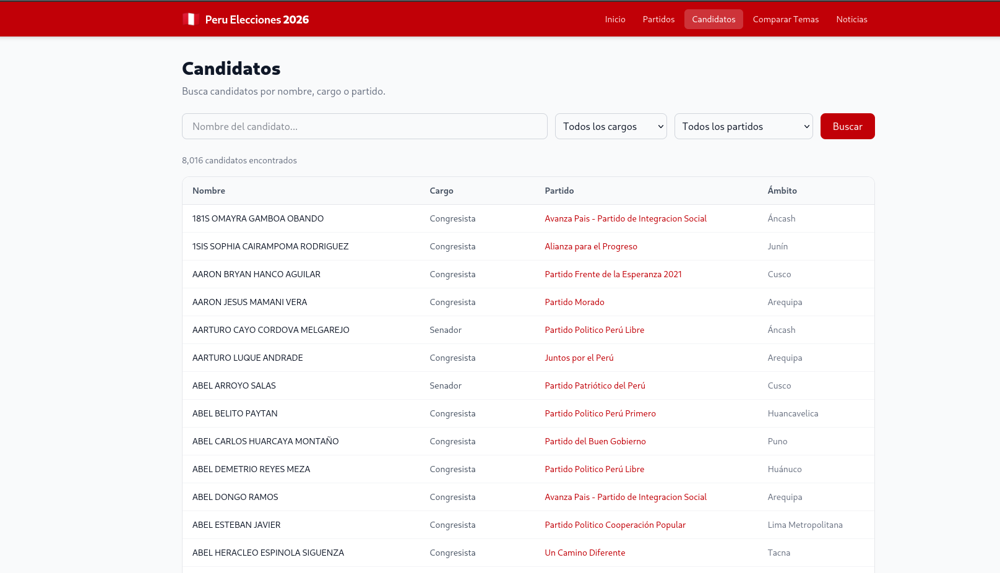
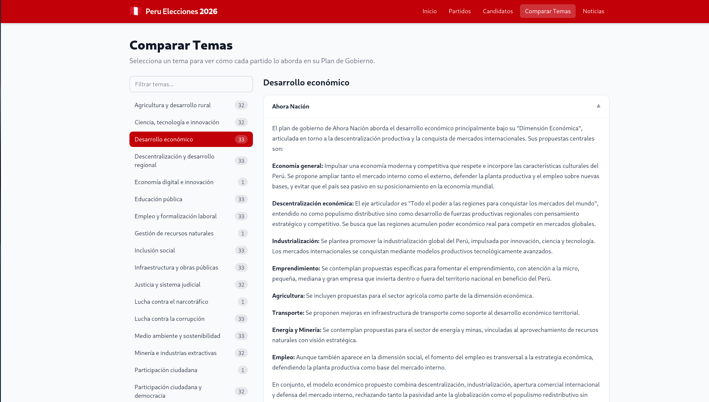

# Peru Elecciones 2026

Plataforma de información cívica para las elecciones generales del Perú 2026. Permite a los ciudadanos comparar
partidos, candidatos, propuestas temáticas y seguir noticias relevantes del proceso electoral.

## Capturas de pantalla

### Inicio (eventos recientes)



### Partidos



### Candidatos



### Comparar temas



## Características

- **Partidos:** Fichas por partido con candidatos y secciones de su plan de gobierno.
- **Candidatos:** Búsqueda y filtrado por cargo (presidente, vicepresidente, congresistas) y partido.
- **Comparar temas:** Comparación de posiciones por partido sobre temas de política pública.
- **Noticias / Eventos:** Feed de eventos recientes generados automáticamente por el módulo Researcher.

## Arquitectura

```
┌─────────────────────────────────────────────────────────┐
│                     Docker Compose                      │
│                                                         │
│  ┌──────────────┐   ┌──────────┐   ┌─────────────────┐ │
│  │  SvelteKit   │   │ Postgres │   │    SearXNG      │ │
│  │  (port 3000) │──▶│  (5432)  │   │   (port 8080)   │ │
│  └──────────────┘   └──────────┘   └─────────────────┘ │
│                           ▲                ▲            │
│                           │                │            │
│  ┌──────────────┐   ┌─────┴──────────────┐ │            │
│  │  OCR Service │   │    Researcher      │─┘            │
│  │  (port 9000) │   │  (Python pipeline) │              │
│  └──────────────┘   └────────────────────┘              │
└─────────────────────────────────────────────────────────┘
```

| Componente    | Tecnología                                        | Puerto |
|---------------|---------------------------------------------------|--------|
| Frontend      | SvelteKit 2, Svelte 5, Tailwind CSS 4, TypeScript | 3000   |
| Base de datos | PostgreSQL 16                                     | 5432   |
| Búsqueda      | SearXNG                                           | 8080   |
| OCR           | FastAPI + Tesseract                               | 9000   |
| Researcher    | Python (psycopg2, httpx, Ollama)                  | —      |

## Requisitos

- [Docker](https://docs.docker.com/get-docker/) y Docker Compose
- (Opcional, para desarrollo local) Node.js 20+, Python 3.11+

## Inicio rápido

```bash
docker compose up --build
```

Esto levanta todos los servicios. La aplicación estará disponible en **http://localhost:3000**.

> En el primer arranque, Postgres inicializa el esquema automáticamente desde `db/schema.sql`.

## Desarrollo local del frontend

1. Levanta solo la base de datos:

```bash
docker compose up postgres
```

2. Instala dependencias e inicia el servidor de desarrollo:

```bash
cd frontend
npm install
npm run dev
```

La app estará en **http://localhost:5173** por defecto.

### Variables de entorno del frontend

Crea un archivo `.env` en `frontend/` si necesitas sobreescribir los valores por defecto:

```env
POSTGRES_HOST=localhost
POSTGRES_PORT=5432
POSTGRES_USER=peru_user
POSTGRES_PASSWORD=peru_password
POSTGRES_DB=peru_elecciones
```

## Módulo Generator

El Generator es el pipeline de ingesta inicial que lee los documentos oficiales de cada partido (PDFs escaneados o Markdown pre-extraído), los procesa con OCR y un LLM, y puebla la base de datos con datos estructurados. Se ejecuta **una sola vez** al inicio del ciclo electoral.

### Requisitos

- Cuenta en [OpenRouter](https://openrouter.ai/) con API key y modelo configurado en `GENERATION_MODEL` (obligatorio)
- Servicio OCR accesible (por defecto `http://ocr:9000`, o `http://localhost:9000` en local)
- Postgres accesible
- Documentos de cada partido ubicados en `data/<nombre-partido>/`

### Estructura de `data/`

Cada subdirectorio dentro de `data/` representa un partido. El nombre de la carpeta se usa como nombre del partido en la base de datos. Los archivos esperados por carpeta son:

| Archivo | Descripción | Usado en |
|---|---|---|
| `Estatuto.pdf` / `Estatuto.md` | Estatuto del partido | Resumen del partido |
| `Ideario.pdf` / `Ideario.md` | Ideario o declaración de principios | Resumen del partido |
| `Listado.pdf` | Lista oficial de candidatos | Ingesta de candidatos |
| `Plan de Gobierno.pdf` / `Plan de Gobierno.md` | Plan de gobierno | Extracción de temas |

> Si existe un archivo `.md` con el mismo nombre que el PDF, se usa directamente sin pasar por OCR.

### Pipeline

El Generator ejecuta tres pasos en orden:

```
1. parties    → Lee Estatuto + Ideario, genera resumen con LLM, inserta en `parties`
2. candidates → OCR del Listado, parsea candidatos con LLM, inserta en `candidates`
3. topics     → OCR de todos los Planes de Gobierno, deriva temas canónicos con LLM,
                extrae sección por partido×tema, inserta en `topics` y `party_sections`
```

### Ejecución

```bash
pip install -r requirements.txt

python -m generator                  # ejecuta los 3 pasos en orden
python -m generator parties          # solo ingesta de partidos
python -m generator candidates       # solo ingesta de candidatos (requiere parties)
python -m generator topics           # solo extracción de temas (requiere parties)
```

### Variables de entorno del Generator

| Variable | Por defecto | Descripción |
|---|---|---|
| `OPENROUTER_API_KEY` | *(obligatorio)* | API key de OpenRouter |
| `GENERATION_MODEL` | *(obligatorio)* | Id del modelo en OpenRouter (ver [modelos](https://openrouter.ai/models)) |
| `OPENROUTER_BASE_URL` | `https://openrouter.ai/api/v1` | Base URL de la API compatible con OpenAI |
| `OPENROUTER_TIMEOUT` | `300.0` | Timeout en segundos para llamadas al LLM |
| `OPENROUTER_HTTP_REFERER` | — | Opcional; URL del sitio (header recomendado por OpenRouter) |
| `OPENROUTER_APP_TITLE` | — | Opcional; nombre de la app (header `X-Title`) |
| `OCR_URL` | `http://ocr:9000` | URL del servicio OCR |
| `OCR_TIMEOUT` | `600.0` | Timeout en segundos para OCR (PDFs grandes pueden tardar >2 min) |
| `POSTGRES_HOST` | `localhost` | Host de PostgreSQL |
| `POSTGRES_USER` | `peru_user` | Usuario de PostgreSQL |
| `POSTGRES_PASSWORD` | `peru_password` | Contraseña de PostgreSQL |
| `POSTGRES_DB` | `peru_elecciones` | Nombre de la base de datos |

### Detalle de cada paso

**`parties` — Ingesta de partidos**

1. Itera los subdirectorios de `data/`.
2. Extrae texto de `Estatuto` e `Ideario` (`.md` directo, o PDF/imagen vía OCR).
3. Envía el texto combinado (hasta 12 000 caracteres) al LLM con un prompt neutral para generar un resumen descriptivo de máximo 200 palabras.
4. Hace upsert del registro en la tabla `parties`.

**`candidates` — Ingesta de candidatos**

1. Para cada partido, hace OCR del archivo `Listado.pdf`.
2. Divide el texto en chunks de 10 000 caracteres y envía cada uno al LLM.
3. El LLM devuelve un array JSON con los campos `name`, `position`, `scope` y `list_order`.
4. Inserta los candidatos en la tabla `candidates` vinculados a su partido.

Los valores válidos para `position` son: `Presidente`, `Vicepresidente`, `Senador`, `Congresista`, `Parlamento Andino`.

**`topics` — Extracción de temas**

1. Recopila el texto del `Plan de Gobierno` de todos los partidos.
2. Envía una muestra (primeros 1 500 caracteres de hasta 20 partidos) al LLM para derivar una lista canónica de 10–20 temas de política pública.
3. Por cada combinación partido × tema, extrae y resume la sección relevante del plan (hasta 400 palabras).
4. Persiste los temas en `topics` y las secciones en `party_sections`.

---

## Módulo Researcher

El Researcher consulta SearXNG por cada candidato en la base de datos, resume los resultados con un modelo LLM via
Ollama e inserta eventos en la tabla `events`.

### Requisitos

- Ollama corriendo localmente con el modelo configurado (por defecto `granite4:latest`)
- SearXNG accesible (por defecto `http://localhost:8080`)
- Postgres accesible

```bash
pip install -r requirements.txt
python -m researcher --once   # una sola pasada
python -m researcher          # modo continuo (cada RESEARCHER_SCHEDULE_INTERVAL segundos)
```

### Variables de entorno del Researcher

| Variable                       | Por defecto                    |
|--------------------------------|--------------------------------|
| `POSTGRES_HOST`                | `localhost`                    |
| `POSTGRES_USER`                | `peru_user`                    |
| `POSTGRES_PASSWORD`            | `peru_password`                |
| `POSTGRES_DB`                  | `peru_elecciones`              |
| `SEARXNG_URL`                  | `http://localhost:8080`        |
| `OPENROUTER_API_KEY`          | ``                              |
| `OPENROUTER_BASE_URL`          | `https://openrouter.ai/api/v1` |
| `SUMMARIZATION_MODEL`          | `granite4:latest`              |
| `RESEARCHER_SCHEDULE_INTERVAL` | `3600` (segundos)              |

## Servicio OCR

Microservicio FastAPI para extraer texto de imágenes y PDFs (usado por el módulo Generator para ingestar planes de
gobierno).

**Endpoints:**

| Método | Ruta                | Descripción                 |
|--------|---------------------|-----------------------------|
| `GET`  | `/health`           | Health check                |
| `POST` | `/ocr/image`        | OCR de imagen (multipart)   |
| `POST` | `/ocr/image/base64` | OCR de imagen (base64 JSON) |
| `POST` | `/ocr/pdf`          | OCR de PDF (multipart)      |
| `POST` | `/ocr/pdf/base64`   | OCR de PDF (base64 form)    |

El servicio usa Tesseract con soporte para español (`spa`) por defecto.

## Estructura del proyecto

```
peru-elecciones-2026/
├── config/
│   └── searxng/          # Configuración de SearXNG
├── data/                 # Material fuente por partido (PDFs, Markdown)
├── db/
│   ├── schema.sql        # DDL de PostgreSQL
│   └── connection.py     # Helpers de conexión para scripts Python
├── frontend/             # Aplicación SvelteKit
│   └── src/
│       ├── lib/server/
│       │   └── db.ts     # Queries a PostgreSQL
│       └── routes/
│           ├── +page.*           # Inicio (últimos eventos)
│           ├── partidos/         # Listado y detalle de partidos
│           ├── candidatos/       # Búsqueda y detalle de candidatos
│           ├── temas/            # Comparación de propuestas temáticas
│           └── noticias/         # Feed de eventos
├── generator/            # Pipeline de ingesta inicial (OCR + LLM → DB)
│   ├── ingest_parties.py     # Paso 1: partidos y resúmenes
│   ├── ingest_candidates.py  # Paso 2: candidatos desde Listado.pdf
│   ├── ingest_topics.py      # Paso 3: temas y secciones de planes de gobierno
│   ├── llm_client.py         # Cliente OpenRouter
│   ├── ocr_client.py         # Cliente del servicio OCR
│   └── config.py             # Configuración por variables de entorno
├── ocr/                  # Servicio OCR (FastAPI + Tesseract)
├── researcher/           # Pipeline de búsqueda y resumen con LLM
├── docker-compose.yml
├── requirements.txt      # Dependencias Python (researcher/db)
└── PROPOSAL.md           # Propuesta y arquitectura del proyecto
```

## Scripts del frontend

```bash
npm run dev      # Servidor de desarrollo
npm run build    # Build de producción
npm run preview  # Preview del build
npm run check    # Type-check con svelte-check
```
